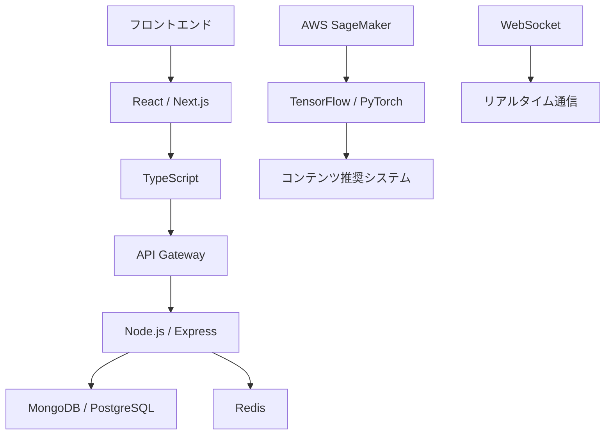

# README.md

## 提案概要

本提案では、クリエイターとファンをつなぐグローバルSNS・チャットサービスの開発に向けた技術的アプローチについて説明します。多言語対応や大規模トラフィックに対応したパフォーマンス設計、リアルタイム通信の実装など、複雑な要件を満たすための最適なソリューションを提案いたします。

## 技術選定と理由

### 1. フロントエンド
- **React / Next.js**: 高速でスケーラブルなSPA開発が可能。サーバーサイドレンダリング（SSR）や静的サイト生成（SSG）をサポートし、SEO対策にも優れています。
- **TypeScript**: 型安全なプログラミング言語により、コードの品質とメンテナンス性を向上させます。

### 2. バックエンド
- **Node.js / Express**: 非同期処理に適したフレームワークで、スケーラビリティが高く、リアルタイム通信にも対応できます。
- **WebSocket**: チャットや通知機能のリアルタイム実装に最適です。

### 3. データベース
- **MongoDB / PostgreSQL**: NoSQLとRelational DBを組み合わせることで、柔軟性とパフォーマンスのバランスを取ることができます。
- **Redis**: キャッシュやセッション管理に使用し、パフォーマンス向上を図ります。

### 4. AI・機械学習
- **TensorFlow / PyTorch**: ユーザー分析やコンテンツ推奨システムの実装に使用します。
- **AWS SageMaker**: 大規模なデータ処理とモデル訓練に最適です。

## アーキテクチャ図

## 開発アプローチ

1. **要件定義**: アジャイル開発を基に、詳細な仕様書を作成します。ユーザーのニーズとビジネス目標を明確にし、優先順位を設定します。
2. **設計**: ユーザー体験（UX）とインターフェース（UI）を重視した設計を行います。多言語対応やセキュリティ対策も考慮に入れて設計します。
3. **フロントエンド開発**: React / Next.jsを使用して、高速でスケーラブルなSPAを開発します。TypeScriptを用いてコードの品質とメンテナンス性を向上させます。
4. **バックエンド開発**: Node.js / Expressを使用してAPIを作成し、MongoDB / PostgreSQLでデータベースを管理します。WebSocketを使用してリアルタイム通信を実装します。
5. **保守・運用**: 監視ツール（AWS CloudWatchなど）を使用してシステムのパフォーマンスと障害状況をモニタリングします。定期的なメンテナンスとセキュリティアップデートを実施します。

## 本提案の強み

1. **多言語対応**: ユーザー体験を向上させるために、多言語対応を徹底しています。
2. **パフォーマンス最適化**: 大規模トラフィックに対応したアーキテクチャ設計とキャッシュ使用により、高速で安定したサービス提供が可能です。
3. **AI・機械学習の活用**: ユーザー分析やコンテンツ推奨システムを実装することで、サービスの機能性とユーザーレタイア率を向上させることができます。

本提案では、クリエイターとファンをつなぐグローバルSNS・チャットサービスの開発に最適な技術的アプローチを提供いたします。ご検討いただければ幸いです。