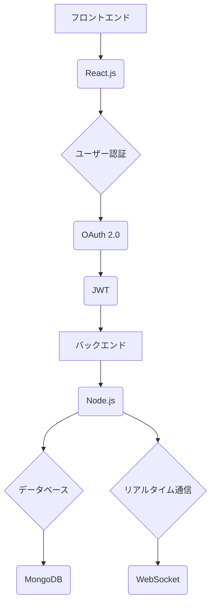

【技術アーキテクチャドキュメント】

**プロジェクト名:** グローバルSNS・チャットサービス

**概要:**
このプロジェクトでは、クリエイターとファンをつなぐグローバルなSNS・チャットサービスを開発します。既に国内外でユーザーが増えており、開発体制の強化が必要です。海外ユーザーが2〜3割程度を占めるため、多言語・多文化に対応した設計が求められます。

**技術選定基準:**
1. **フレームワーク:** React.js（フロントエンド）とNode.js（バックエンド）を選択しました。React.jsはパフォーマンスの高いUI開発を可能にし、Node.jsは非同期処理が得意でスケーラブルです。
2. **データベース:** MongoDBを選択しました。NoSQL構造により、大量のデータを効率的に管理できます。
3. **通信プロトコル:** WebSocketを使用してリアルタイムチャットと通知機能を実装します。
4. **セキュリティ:** OAuth 2.0とJWT（JSON Web Token）を使用して認証と認可を行います。

**アーキテクチャ図:**

**トレードオフ:**
1. **パフォーマンス vs 安全性:** WebSocketを使用することでリアルタイム通信が可能ですが、セキュリティ面で注意が必要です。OAuth 2.0とJWTを組み合わせることで、両者のバランスを取っています。
2. **開発速度 vs スケーラビリティ:** React.jsとNode.jsを選択することで、開発速度が向上しますが、スケーラビリティも高いです。

**結論:**
このアーキテクチャは、多言語対応、パフォーマンス優先、セキュリティ強化を考慮した設計となっています。大規模なトラフィックに対応し、ユーザーの利用体験を向上させることが可能です。

**開発工程:**
1. **要件定義:** ユーザーのニーズとサービスの機能を明確にします。
2. **設計:** アーキテクチャ図に基づいて詳細な設計を行います。
3. **フロントエンド開発:** React.jsを使用してユーザーインターフェースを開発します。
4. **バックエンド開発:** Node.jsとMongoDBを使用してAPIを構築し、データ管理を行います。
5. **リアルタイム通信の実装:** WebSocketを使用してチャットと通知機能を実装します。
6. **テストとデプロイメント:** 各モジュールをテストし、サービスをデプロイします。

このアーキテクチャは、プロジェクトの目標に最適な設計となっています。